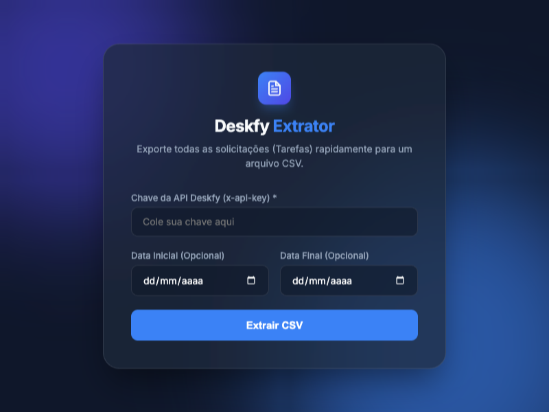

# Deskfy Extrator CSV

Uma ferramenta web simples e eficiente para extrair dados de solicitações (Tarefas) da API do Deskfy.io e exportá-los diretamente para um arquivo CSV.

👉 **[Acesse o Deskfy Extrator online](https://nfbrentano.github.io/deskfyExtrator/)**

## 📸 Interface da Aplicação

## 🚀 Como Usar

Para extrair suas tarefas da plataforma Deskfy, siga os passos abaixo:

1. **Acesse a Ferramenta:**
   Abra o [Deskfy Extrator](https://nfbrentano.github.io/deskfyExtrator/) no seu navegador.

2. **Obtenha e Insira sua Chave de API:**
   - Acesse sua conta no Deskfy e gere ou copie a sua chave de acesso à API (`x-api-key`). 
   - Cole a chave no campo **"Chave da API Deskfy (x-api-key) *"** na tela inicial da ferramenta.

3. **Defina os Filtros (Opcionais):**
   - **Data Inicial:** Selecione a partir de qual data de cadastro você deseja extrair as tarefas.
   - **Data Final:** Selecione até qual data de cadastro você quer extrair as tarefas.
   - *Nota: Se nenhuma data for informada, o sistema extrairá todas as tarefas associadas à chave da API informada, sem filtro de tempo.*

4. **Inicie a Extração:**
   - Clique no botão **"Extrair CSV"**.
   - Aguarde enquanto os dados são processados. A ferramenta buscará os dados em lotes, garantindo que mesmo grandes quantidades de tarefas sejam extraídas rapidamente e de forma transparente.
   - Concluída a extração, um download automático de um arquivo CSV (ex: `tarefas_deskfy.csv` ou com os sufixos de data escolhidos) será iniciado em seu navegador.
   - O arquivo CSV pode ser facilmente aberto em planilhas como Excel, Google Sheets, etc.

## 🛠 Tecnologias Utilizadas

- **HTML5:** Estrutura semântica.
- **CSS3:** Estilização moderna (*Glassmorphism*), interface limpa, animações suaves e design totalmente responsivo.
- **JavaScript (Vanilla):** Lógica interna e de interação do usuário, motor de requisições `fetch` assíncronas consumindo a API da Deskfy, conversão de JSON para CSV, e gatilho de download via Blob no *client-side*.

---
*Este projeto e seu autor são independentes e não têm afiliação oficial com a plataforma Deskfy.io.*
